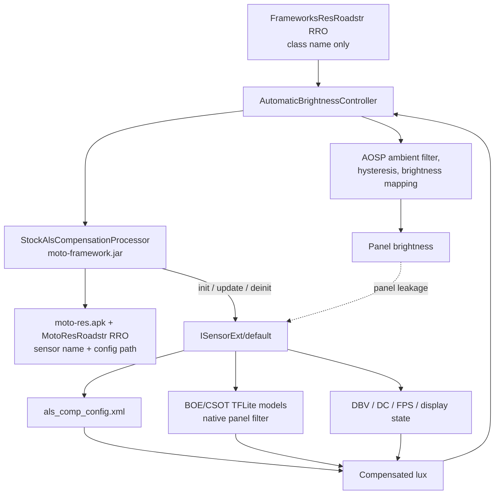
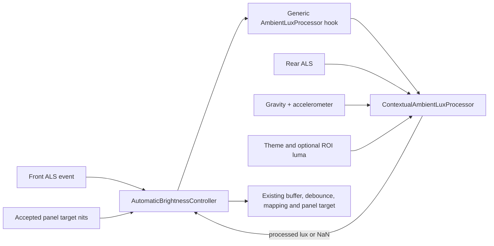

# Stock ALS Compensation Design Document

> **Superseded implementation (2026-09-05).** This document describes the
> earlier ROI/rear-sensor Java experiment. It is retained as historical design
> context only. The active Roadstr implementation uses the device-local
> `StockAlsCompensationProcessor` bridge to Motorola `ISensorExt` and the stock
> vendor ALS models. Do not re-enable `ContextualAmbientLuxProcessor` for
> normal builds; see `documents/roadstr-stock-moto-auto-brightness-findings.md`.

## Active solution: stock Motorola compensation

The active workflow is intentionally short and device-local:

1. `FrameworksResRoadstr` sets `config_ambientLuxProcessorClass` to the
   bridge class name only; no sensor or file parameters are encoded in the
   framework resource.
2. `AutomaticBrightnessController` loads the class in `moto-framework.jar`
   when automatic brightness starts.
3. `StockAlsCompensationProcessor` reads the sensor name and configuration path
   from `com.motorola.res` (the platform `moto-res.apk` plus the Roadstr
   `MotoResRoadstr` product RRO).
4. The bridge initializes Motorola `ISensorExt`, sends each primary ALS sample
   to `updateSensorLux`, and returns the vendor-compensated lux to the normal
   AOSP filtering, hysteresis, and brightness mapping.
5. SensorExt reads DBV/DC/display state and applies the packaged panel config,
   TFLite model, and native filter. No rear sensor, ROI sampling, custom
   leakage curve, or target-history feedback is used in this active path.

```text
Frameworks RRO (class only)
        -> system_server / moto-framework.jar
        -> MotoRes APK + Roadstr RRO (sensor/config identifiers)
        -> ISensorExt Binder bridge
        -> vendor ALS config + model + panel state
        -> compensated lux -> AOSP auto-brightness controller
```



The dotted feedback edge is handled inside the vendor compensation path using
panel state and calibrated models; the Java bridge does not maintain a second
leakage estimator or fuse rear-sensor/ROI data.

## Purpose

Roadstr's display-facing ambient-light sensor (ALS) receives light leaked from
bright screen content. In dim surroundings, a conventional single-sensor
controller can form a feedback loop: the panel brightens, the front ALS reports
more lux, and automatic brightness raises the panel target again.

The historical **Contextual Ambient Lux Fusion** policy returned a corrected
lux value to the existing LineageOS automatic-brightness controller.
It combines target-nits-aware front-ALS leakage compensation with a guarded rear
ALS reference. The standard controller still owns its sensor buffer, debounce,
hysteresis, brightness curve, user model, thermal limits, HBM/HDR limits, and
panel output.

## Inputs

| Input | Published type | Policy role |
| --- | --- | --- |
| Front ALS | `android.sensor.light` | Framework-owned primary measurement |
| Rear ALS | `com.motorola.sensor.alternate_light` | Independent ambient reference |
| Gravity and accelerometer | Android standard types | Detect probable rear-sensor occlusion |
| SurfaceFlinger composition sampling | Optional | Measure screen luma at the front ALS footprint |

The rear ALS is `ON_CHANGE`. A stable sample remains useful in stable lighting,
but its confidence decays after the configured grace period so stale data cannot
indefinitely request a brightness increase.

## Historical architecture (superseded)



The framework owns the front ALS listener and calls the processor synchronously
for each front sample. The device processor owns the rear, gravity,
accelerometer, and optional composition-sampling listeners. This avoids a second
front listener, whose callback ordering relative to the framework would be
undefined.

The framework extension is intentionally small and generic:

1. Discover an optional class through `config_ambientLuxProcessorClass`.
2. Start and stop it with automatic brightness.
3. Report the controller's accepted target nits using the sensor-event time
   base.
4. Pass each primary ALS sample to `process()`.
5. Continue with the unmodified primary reading if the processor returns `NaN`
   or fails.

## Implementation Record

The current implementation is composed of the following commits. The three
`frameworks/base` commits define a disabled-by-default hook; they contain no
Motorola sensor types, calibration data, or Roadstr-specific logic. The device
commits install and configure the policy.

| Repository | Commit | Title |
| --- | --- | --- |
| `frameworks/base` | `9a9caba6fa2492e3d2c75d622d8a7ddffb3395ce` | `feat(display): add ambient lux processor hook` |
| `frameworks/base` | `e9fdc7201c4d6622ee6439916de5833e45a1e3f9` | `feat(display): add target-aware lux hook` |
| `frameworks/base` | `00b4a8653d0c745a05fdbdb37143e0c3afe9eedf` | `fix(display): retain applied nits for lux hooks` |
| `device/motorola/roadstr` | `e962b5c73d462ed1ed4c0096d273b5a48ec4db7f` | `feat(display): add contextual lux fusion` |
| `device/motorola/roadstr` | `f9ae654435094c2ccb790b1682eaf02b2140fd3f` | `fix(display): stabilize contextual lux fusion` |
| `device/motorola/roadstr` | `9912749b12d49edf2340fdeb1f401f699ca5570a` | `feat(display): add ROI leakage compensation` |

See [the framework patch guide](frameworks_base_patch.md) for the portable
interface and integration excerpts needed on a branch that lacks the framework
commits.

## Processing Policy

For each front ALS sample, the processor:

1. Finds the accepted target nits that preceded the sample by the configured
   panel-to-ALS delay.
2. Interpolates a calibrated leakage curve for that target.
3. Uses a fresh local SurfaceFlinger luma sample to scale a pure-white leakage
   curve when available; otherwise it uses light- or dark-theme fallback curves.
4. Subtracts the bounded leakage estimate and filters the corrected front lux.
5. Separately filters the rear lux and derives its confidence from freshness,
   posture, and motion.
6. Uses the corrected front estimate as the normal baseline. A credible rear
   sample can make only a confirmed, bounded, slew-limited upward adjustment.
   A persistent, credible low rear sample can constrain likely residual display
   leakage through a separate downward path.
7. Returns ordinary lux, allowing the existing controller to apply normal
   debounce and brightness mapping.

The policy is deliberately asymmetric. The rear sensor is an auxiliary
reference rather than an equal replacement for the front sensor. Averaging the
two sensors in their ordinary agreeing path caused handset posture changes to
move brightness unnecessarily.

## Device-tree Layout

| Path | Responsibility |
| --- | --- |
| `moto-framework/src/com/motorola/display/StockAlsCompensationProcessor.java` | Thin SensorExt Binder bridge installed in `system_server` as `moto-framework.jar` |
| `moto-res/` | Platform-signed `com.motorola.res` APK with safe defaults and overlayable resources |
| `resource-overlay/roadstr/MotoRes/` | Static product RRO with Roadstr calibration and tuning |
| `resource-overlay/roadstr/Frameworks/res/values/strings.xml` | Enables the bridge with the class name only |
| `device.mk` | Installs the JAR, resource APK, RRO, permissions XML, and system-server declaration |

Device-specific values belong in `com.motorola.res` and its Roadstr RRO, never
in `framework-res` or a pipe-delimited class declaration. The active resource
set contains the SensorExt sensor identifier and vendor ALS configuration path;
panel calibration/model data remains in the stock vendor partition.

## Resources and Tuning

| Resource group | Purpose |
| --- | --- |
| `config_motoRearLightSensorType`, `...SampleMaxAgeMs` | Rear-sensor discovery and aging |
| `config_motoAmbientLuxLeakageNits` | Strictly increasing nits axis for all leakage curves |
| `...LightThemeLeakageLux`, `...DarkThemeLeakageLux` | Fallback sensor-equivalent leakage curves |
| `...RoiWhiteLeakageLux`, `...Roi*` | Optional local-content correction, calibrated against pure white |
| `...DisplayToAlsDelayMs`, `...LeakageHoldAfterTargetDropMs` | Panel/sensor time alignment and post-dim rebound control |
| `...Front/RearMeasurementVariance`, `...ProcessNoise` | Estimator responsiveness |
| `...RearDown*`, `...Stationary*`, `...RearOcclusionDwellMs` | Rear-down, stationary occlusion guard |
| `...RearAssist*` | Conservative upward rear assistance |
| `...RearConstraint*` | Conservative downward residual-leakage correction |

Leakage curves are front-sensor-equivalent lux, not panel nits or a physical
transmission coefficient. Each curve must be non-negative and match the nits
axis length. The processor validates resources and disables leakage correction
rather than risking a crash or unbounded subtraction when calibration is invalid.

## Calibration and Validation

Collect leakage data in a genuinely dark environment with the front ALS
uncovered. Disable automatic brightness, sweep the panel target monotonically,
and wait for panel and sensor settling at each point. Measure both a known
fallback surface and a pure-white surface covering the physical front-ALS
footprint.

Validate every retune in these cases:

- dark room with light-theme bright content;
- dark room with dark theme;
- bright-to-dark and dark-to-bright transitions;
- rear sensor exposed, shaded, and rear-down on a table;
- stable light while moving or rotating the handset; and
- screen off/on plus automatic-brightness enable/disable transitions.

Enable diagnostics only during validation:

```sh
adb shell setprop persist.sys.moto.ambient_lux_debug 1
adb logcat -s StockAlsCompensation
```

The processor log includes raw front lux, target nits, estimated leakage,
filtered front/rear lux, rear confidence, policy mode, output lux, and whether
ROI or theme fallback supplied the correction. Disable the property after
investigation.

## Status and Limits

The leakage compensation, rear-reference guards, and optional local-luma ROI
path are implemented. ROI processing is bounded and falls back to the theme
tables whenever a matching composition sample is unavailable or stale.

This policy is not hardware independent. Every panel/sensor arrangement needs
its own leakage curves, ROI, sensor-reporting treatment, and posture thresholds.
An aggressive curve can subtract real environmental illumination and oscillate;
a weak curve leaves residual self-excitation. Change one tuning group at a time
and use physical transition logs before shipping a retune.

For the full investigation history, calibration evidence, and commit record,
see [`documents/roadstr_dual_sensor_auto_brightness.md`](../../../../../documents/roadstr_dual_sensor_auto_brightness.md).
